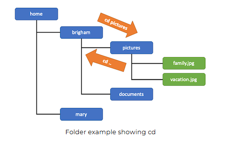
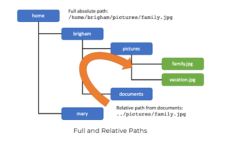

# W01 Learning Activity: Version Control

## Overview
This activity will help you become familiar with version control systems and using use Git and GitHub.

## Preparation Material

### What is Version Control?
Read about Git and version control systems from the official GitHub documentation:

- Read: About Git

Don't worry too much about the details of all the commands shown in their examples. You will learn them in more detail as you practice below.

## Files and Folders
Before you can do very much Git, it is important to make sure you are comfortable with Files and Folders on your computer.

As you start to create larger programs, it is no longer feasible to keep all of your code in one single file. When you separate your code into different files, you should put all of the code that relates to a certain concept or idea together. This is another application of the principle of abstraction that is a fundamental concept of this course.

In addition to the cognitive benefits of not keeping thousands of lines of code in your brain and scrolling around in extremely long files, separating your code into multiple files is also very helpful when multiple people are developing the program together. When different people are working on separate parts of the program, they won't be be editing the same files as much, which makes merging the changes in a version control system even easier.

By the end of this course, you will be writing programs that use a fairly large number of files. This can seem overwhelming at first, but as you'll learn, each one of those files will be small and narrowly focused to one idea, so it makes working with a large system much easier.

To prepare for this, you first need to be familiar with file and folder organization on your computer generally, then, you'll need to learn the conventions of how C# programs are distributed into multiple files.

### The File System
All of the data stored on your computer is stored in a file system. This is a hierarchical structure of folders and files.

A folder can contain multiple files and also can contain other folders. The following image shows an organization where the root, or top-most level is a "home" folder, that contains other folders such as "brigham" and "mary", each of which could contain other folders or files.

Folder Example  
Folder Example

You can browse the files and folders on your computer using a graphical file browser, and you can also navigate using a command line terminal. You can use a terminal directly from your operating system, or there is also a terminal window available in editors like VS Code where you can enter commands.

The specific commands can differ between operating systems, but they generally follow the same principles. If you are using the command line terminal "Git Bash" on Windows, it will let you use Linux style commands (used by MacOS as well), so those are what will generally be shown in the course materials.

### Heads up! Folders or Directories?
Is it called a folder or directory? Both—You'll find that people use these terms interchangeably.

The term "directory" was more common in the command line terminal world, but as people moved into graphical file system browsers, they started to use the term "folder." As a programmer, you'll see both terms and should be comfortable with them.

### Moving Around in the File System
One principle that is important to understand is that when you are using a command line terminal, you will be currently "in" a particular directory or folder. This is called the current working directory. You learn see the current directory by typing the command pwd (print working directory).



You can change directories by using the cd command followed by the name of the directory to change to. For example, cd pictures moves into a folder beneath or in the current folder named, "pictures". A single period . refers to the current directory, and two periods .. refers to the parent directory. Thus, typing cd .. will change to the parent folder of the one you were in.

Folder example showing cd  
Folder example showing cd

### Accessing Files and Folders
There are two ways to refer to a location in the file system, an absolute, or full path to the location, or a relative path that describes the location in relation to your current location.



For example, a file might have an absolute path of /home/brigham/pictures/family.jpg and you could always use that full path to refer to it, but if you were already in the /home/brigham directory, you could refer to it as pictures/family.jpg (or an equivalent way that uses the the single period, current directory notation: ./pictures/family.jpg ). If you were in the directory /home/brigham/documents and wanted to use a relative path to find that file, you could use the parent directory notation ../pictures/family.jpg to first "go up" a directory and then go to the proper location.

Folder example showing full and relative paths  
Full and Relative Paths

### Is it a forward slash or backslash?
The difference of forward slash / and backslash \ is another awkward difference of operating systems that stems from their history.

Linux/Unix based systems (including MacOS) use forward slash / in their paths, and do not begin full absolute paths with a drive letter (for example, they use /home/brigham ).

Windows based systems tend to use a backslash \ and start with a drive letter (for example, they use C:\Users\Brigham ). Sometimes Windows systems are tolerant of using the forward slash, but MacOS and Linux very rarely allow backslashes.

## Using Git
The following will describe how to use Git at the level you will need from this course. This only scratches the surface of what Git can do. You will get more practice with Git in future courses where you will collaborate with team members and make use of Branching and Merging. In the course, we will focus only on adding, committing, and pushing code to GitHub.

### Command line versus a Graphical User Interface
Tools like Git were originally designed as command line tools. There are also Graphical User Interface (GUI) tools and plugins for most editors that make it easy and convenient to do many things in Git. These are great to use and can simplify your development work, but you should also learn how to use them from the command line.

There are a few very important reasons to learn to use Git from the command line. One reason is that when you tell people you "know Git", such as on a resume or in an interview, they will assume you have a basic understanding of how to use it at the command line as well. Another is that while the GUI tools are very convenient when everything is in a clean working state, sometimes unexpected things happen. When they do, it is almost always easiest to close down the GUI tool, return back to the command line and start with `git status` and work from there.

In this example you will learn both.

### Create a new repository
The first step to using git is to create a new repository (or "repo" for short). One way to do this is to create the repo at GitHub and then clone it to your computer. (It is also possible to create one directly using git init and then push it to GitHub later.)

In the Course Setup instructions you did the following:

- Created an account at GitHub.com.
- Signed in to GitHub.
- Created a new repository from a template.

Those steps helped you create your first repository which is hosted at GitHub.com.

### Wait, is it Git or GitHub?
It's worth recognizing that Git and GitHub are different. Git is a program that helps us manage versions of the files in our projects. Git stores these files and their history in a repository (or "repo" for short). With Git, every computer stores a complete copy of the repo. Then, you can push your repo to another computer, which says "make that one look like mine." Or, you can pull from another computer, which says, "make mine look like that one."

Rather than having to push and pull to every person on your team, we can instead set up a central server and have each person interface with that. This is where GitHub comes in. GitHub allows us to host a repository on their servers and use that as a central place for our team. They also provide a number of other tools to aid in the management of the repo. There are a number of other places that provide this same functionality, but GitHub is a popular choice that we'll use in this course.

### Clone the repository
Once your repository is created at GitHub you can get a copy of it on your local computer with the git clone command.

Remember that the repository contains all the files in the project and the complete history of changes made to them. So when you clone this repository to your computer, you now have a copy of the complete history showing all the changes that everyone on your team has made.

In the Course Setup instructions, you did this when you entered the URL for your repository and clicked "Clone this Repository." In the background, this ran the git clone command for you.

### Making Changes
Creating a repository and cloning it to your computer only needs to be done once at the beginning of the project, so those commands are not used as frequently. Once you have everything set up, you will begin your regular process of making changes and pushing them to GitHub.

Any changes need to go through the following steps:

1. Make your changes
2. Add them to a staging area where they get ready for the next commit.
3. Commit all the changes that have been staged.
4. This stores the changes in the repo on your computer, but they are not at GitHub yet.
5. Push your repo to GitHub.
6. This sends your changes and makes sure the two repos (on your computer and at GitHub) are in sync.
7. If you were working with another person, Git would make you "pull" from GitHub at the same time to make sure you get a copy of any changes that GitHub has that your computer does not have yet.

### Adding Files
To add a file to the staging area so that it can be part of the next commit, you use the command git add followed by the name of the file that has changed or been created. For example:

```bash
git add myFile.txt
```

If you are running the git command from a different folder, it is important that you specify the full name of the file, using either an absolute or a relative path. For example:

```bash
git add csharp-prep/Prep1/Program.cs
```

You can also specify a directory, which will add anything that has changed in that directory (or any subdirectories beneath it). Remembering that the single period . represents the current directory, you can use a shorthand syntax to add the current directory and everything beneath it by typing:

```bash
git add .
```

If you would like to use the VS Code extension for Git, you can click on the Source Control tab on the left menu. This will show you any files that have changed. You can click the "+" icon next to any of these files to add them to the staging area for the next commit.

### Committing Files
When you are ready to commit all of the files that have been staged, you use the git commit command followed by a commit message. For example:

```bash
git commit -m "Fixed problems where nothing was displayed on the screen."
```

It is important to choose a message that will help you and any teammates know why you made the changes you did, in case you need to track down problems later.

In fact, it is so important to leave a message that Git will not let you do a commit without a message.

If you are using the VS Code extension for Git, on the Source Control tab on the left menu, there is a box for you to type your message and then you can click the button to commit.

### Things to watch out for: Forgetting your comment
If you forget to include a commit message, git will take you to a text editor to type one in. On most systems this will take you to a default editor called vim. This may or may not be your favorite editor. If it is not, and you simply want to exit, press the Escape key a couple of times and then type :q! (the : tells it you are entering a command, the q says you want to quit, and the ! says you are not worried about saving changes).

This will help you exit the editor. You can then run the commit command again, this time with the -m for your message.

### Pushing your changes to GitHub
Once you have committed your changes to your local repository, you can push them to GitHub using the git push command. For example:

```bash
git push origin main
```

In this example, "origin" is the name of the remote server, and the word "origin" is convention for your main server. The word "main" is the branch that you would like to push to in case you are trying to keep certain changes separate from one another. This semester we will always use "origin" and "main". And, in fact, when you clone a repo from GitHub, these will be set as defaults, so if you want to use them, you only need to type:

```bash
git push
```

If you are using the VS Code Extension for Git, on the Source Control tab on the left side, after you have committed your changes, you can click the button to "Sync Changes", or alternatively, you can click on the three dots and select "Push".

When you sync, it will check for any changes that have been made at GitHub and pull them down, and then push your changes up. Because you are the only one working on your project, you will likely not need to pull any changes down.

### Checking the status of your repo
One of the most helpful git commands is git status. It will tell you the current status of your files and repository and have commands that you might want to run (such as if you want to undo a staged file, etc.).

When everything is running smoothly the commands above or using the VS Code Extension works great. But, if anything out of the ordinary happens, git status can be very helpful in understanding what has happened and what to do next.

### A typical Workflow
The typical process for working on your program is to change files, add them, commit changes, and then push to GitHub. The following video shows this in action:

Direct Link: A Typical Workflow using Git (10 minutes)

## Assignment Instructions
Practice working with Git by doing the following:

1. Open your course project folder in VS Code.
2. Make a change to the README.md file such as adding your name or removing the line that says, "This is the starter code."
3. Add your changes to the staging area.
4. Commit your staged files to your local repository.
5. Push your changes to GitHub.
6. In a Web browser, navigate to GitHub.com and verify that you can see your changes in the README.md file.

## Submission Instructions
Once you have finished the assignment, return to Canvas to submit the quiz to report on your progress.

## Getting Help
Working with a new tool and process can be difficult. You will use Git throughout the semester and through practice will become much more comfortable with it.

If you have trouble with any of the steps in this assignment, remember to post questions to MS Teams where you can receive help from your classmates.
