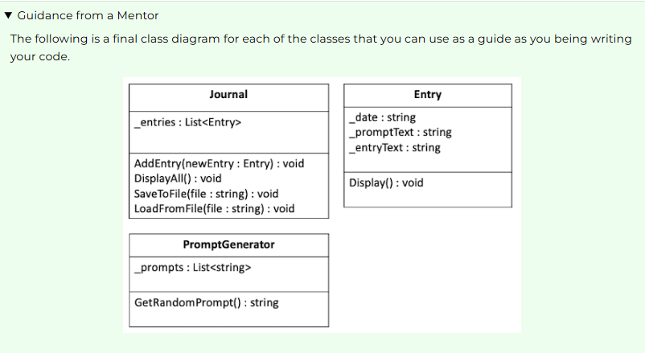

# W02 Team Activity: Journal Design

## Overview
This activity will walk you through the process of creating a design for your developer project. It is very important that you understand the decisions and tradeoffs that are made along the way so that later on, you can produce a design on your own with less guidance.

## Team Activity Instructions
This activity is designed to be completed as a team, working together synchronously on a video call.

For this and future team activities, you will choose someone to be the lead student. The lead student should help guide the discussion and ask the questions. Then, you will choose a different person to be the lead student for the next meeting.

This activity contains two kinds of questions. The first are questions that help you build up the design. To make sure that you have a solid design to use for your program, "Guidance from a Mentor" will be provided to help.

### Guidance from a Mentor
This activity is designed to help you walk through the design process as a team. Because decisions in the first steps determine many steps that follow, we want to make sure you do not start down a path that will lead to problems later. Similarly, when you start writing the code for your project, it is important that you have a solid design to work from, and one that will will reinforce the concepts of the course.

If we were in a conference room together at a company, a mentor could quietly observe the discussion and only interject if the conversation started to lead in a bad direction.

In the case of this activity, because the instructor cannot be in each team meeting, we have placed expandable "Guidance from a Mentor" sections throughout the design process. You should not expand and look at these sections until you have done your best as a team to answer the questions. Then, after you have answered the questions, you should check these Guidance sections to make sure you are headed in a good direction.

Keep in mind that there are often many good designs for a given problem, but for this project, you should use the design created here to make sure that you have a good approach that will also reinforce the principles of the lesson.

Make sure to expand and read each Guidance from a Mentor section as you move through the activity.

In addition to the design questions which contain Guidance from a Mentor, you will also see questions to help you evaluate the design, as show below:

### Evaluate the Design
This is an example of how questions will appear.  
These questions will give you a chance to examine the reason for making certain decisions, and to compare and contrast various design possibilities. You should discuss these questions as a group, just as with the other questions, but they will not contain solutions in a "Guidance from a Mentor" box. Instead, at the end of the activity (or during the activity if you would like) you will submit a quiz with your answers to the "Evaluate the Design" questions. Keep in mind that you can submit this quiz multiple times if you would like.

## Agenda
Use the following as an agenda for your team meeting. Whoever is assigned to be the lead student for this gathering should help guide the group through these steps and ask the questions listed here.

### Before the meeting: Verify the time, location, and lead student
This could be as simple as posting a message to your MS Teams channel that says something like, "Hi guys, are we still planning to meet tomorrow at 7pm Mountain Time? Let's use the MS Teams video feature again." Or, if someone else has already posted a message like this, it could be as simple as "liking" their message.

Make sure to identify who will be the lead student for this week. For example, "Emily, are you still good to be the lead student for this week?"

### Begin with Prayer
Discuss the Preparation Learning Activity  
Take a minute to talk about the learning activity from this week. Talk through any difficulties that people had understanding the material or completing the activity.

What part of the learning activity was the hardest for you?

### Review the Program Specification
Refer to the Journal program specification. As a team, review the program requirements and how it is supposed to work.

- What does the program do?
- What user inputs does it have?
- What output does it produce?
- How does the program end?

Guidance from a Mentor  
A good way to think about these questions is to look at the menu options for the program. They will help you think about the various features of the program.

### Determine the classes
The first step in designing a program like this is to think about the classes you will need. When thinking about classes, it is often helpful to consider the strong nouns in the program description.

- What are good candidates for classes in this program?
- What are the primary responsibilities of each class?

Guidance from a Mentor  
The following are good choices for classes, listed with their responsibilities:

- Journal: Stores a list of journal entries
- Entry: Represents a single journal entry.
- PromptGenerator: Supplies random prompts whenever needed.

In addition, your program will also have a Program class that is the starting point for the program and handles much of the user interaction. Because all programs contain this class, and because it is usually simple, only containing a few static methods, and we do not not even create an instance of it, you will often see it excluded from lists like this, where instead, we focus on the classes that model the components of our specific problem.

You might have also considered a "file" class, but in this case, the main concepts to model are the journal and the entry. Being able to load and save these journal entries could be behaviors of these classes, and then you wouldn't need an extra File class. It could certainly be a valid approach to have a class for all the file interaction with methods like SaveToFile and LoadFromFile. These are the hard decisions that programmers have to weigh back and forth. For this program, we will let the Journal class take care of this behavior.

Does the prompt generator really need to be it's own class or could it simply be a method? This is a good question. But by making the prompt generator a class, it can abstract any details associated with generating prompts, such as whether they are loaded from a file, scraped from an internet source, or to make sure make sure duplicate prompts are not given. You may not want all those features now, but the benefit of abstraction is that you could add them later on and not have to change the way the rest of the program works. So, for that reason, it makes good sense to create it as a class now.

Evaluate the Design  
If you followed the design from the "Guidance from a Mentor" section, and then in the future, you changed your program so that the prompts were retrieved directly from a Web database, how many classes would have to be updated?

### Define class behaviors
Now that you have decided on the classes you will need and their responsibilities, the next step is to define the behaviors of these classes. These will become the methods of each class.

Go through each of your classes and ask:

- What are the behaviors this class will have in order to fulfill its responsibilities? (In other words, what things should this class do?)

Guidance from a Mentor  
Clearly, the PromptGenerator class needs to generate prompts.

Many behaviors of the Journal class also come out nicely from the specification. For example, a journal needs to include behaviors such as:

- Adding an entry
- Displaying all the entries
- Saving to a file
- Loading from a file

The Entry class doesn't have too many behaviors. It's main responsibility is to hold data. And yet, because it is in charge of everything that has to do with entries, it would make sense for it to at least have it's own display method. Then, the Journal display method could iterate through all Entry objects and call the Entry display method. The Journal wouldn't have to worry about the details of how the Entry was displayed, this would all be contained within the Entry class.

Converting these ideas to concise method names gives us the following (note that the variable types and return types are shown after the : colon character):

Journal  
AddEntry(newEntry : Entry) : void  
DisplayAll() : void  
SaveToFile(file : string)  
LoadFromFile(file : string)

Entry  
Display() : void

PromptGenerator  
GetRandomPrompt() : string

Evaluate the Design  
What are the potential benefits of having a Display method in the Entry class rather than allowing the Journal's display method to display an entry's date and text directly?

### Define class attributes
Now that you have defined the classes, their responsibilities, and their behaviors, the next step is to determine what attributes the class should have, or what variables it needs to store.

Go through each of your classes and ask:

- What attributes does this class need to fulfill its behaviors? (In other words, what member variables should this class store?)
- What are the data types of these member variables?

Guidance from a Mentor  
A Journal should store a list of Entry objects. The data type for this should be List<Entry>

An Entry should keep track of the date, prompt text, and the text of the entry itself.

In our design, the prompt generator should store a list of potential prompts that it can select from randomly when needed.

Converting these ideas into concise variable names along with their data types gives us the following:

Journal  
_entries : List<Entry>

Entry  
_date : string  
_promptText : string  
_entryText : string

PromptGenerator  
_prompts : List<string>

### Review the Design
Take a minute to review your final design.

Are there any classes, methods, or variables, that you do not understand?

Guidance from a Mentor  
The following is a final class diagram for each of the classes that you can use as a guide as you being writing your code.

Journal program class diagram

Evaluate the Design  
Using this design, when you want to add a new entry to the journal, you will use code such as theJournal.AddEntry(anEntry); instead of using the _entries variable and its add method like this theJournal._entries.Add(anEntry);. What is a benefit of our design approach (the AddEntry method), instead of accessing the variable directly?

### Conclude the Meeting
At this point, you have the design of the classes you will need for this project. If your design is not "perfect," or it needs to change a little as you begin working on the project, that is just fine! As you learn more details, you will naturally need to adjust your planning. This is why the principles of programming with class are so valuable, because they allow your program to easily change.

At the end of your meeting:

- Determine who will be the lead student for the next meeting.

## After the Meeting: Start the code
Now that you have a design for your classes in mind. The next step is to start the code of the program.

You begin programs with classes by creating "stubs" for everything in your design, or in other words, an empty skeleton that contains all of the classes from your design with all of the member variables and methods. At this point, the methods can be (mostly) empty. You will fill them in later as you begin the program.

### Avoid Build Errors
One important factor as you "stub out" your program is that you want to make sure that it can built (we often say "compiled") without errors. This is why some of your methods cannot be completely empty.

If the function has a void return type, meaning it does not return anything, it can be left completely empty.

However, if the function has a return type, you will need to return something, or else you will have errors when you try to run it. For example, if the return type is string then you might include return ""; as a single line of the function so that it will not have errors.

After the team activity, each person needs to individually do the the following:

- Open the project in VS Code. Create new files that contain the "stubs" or empty code for all the classes, member variables, and functions in your design.
- At this point the body of the methods can be empty, except for the necessary return statements.
- Each class should be in its own file and the name of the file should match the class name (for example, Journal.cs).
- Make sure that your program can build without errors.
- Commit and push your code to your GitHub repository.

Need help getting started?  
If you are not sure how to start the code based on this design, watch the following short video that walks through this process:

Starting the Code (9 mins)

## Submission
After completing this activity, return to Canvas to submit two quizzes associated with this activity:

- W02 Team Activity: Journal Design: In this quiz, you will respond to the "Evaluate the Design" questions from the activity above. You may take this quiz 3 times.
- W02 Team Activity: Participation Report: In this quiz, you will report on your participation with your team. The lowest score from this category will be dropped at the end of the course. So if you need to miss one meeting for any reason, it will not be a problem, but it if becomes a pattern, you will not earn full points for your teamwork.
