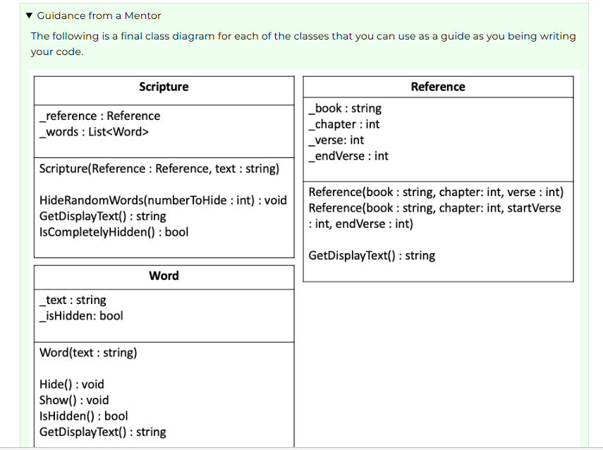

# W03 Team Activity: Scripture Memorizer Design

## Overview
Meet with your team and prepare a design for this week's programming assignment.

## Regarding "Guidance from a Mentor"
Remember that throughout the activity, you'll receive Guidance from a Mentor. You should first answer the questions as a team, then, refer to the Guidance from a Mentor section to make sure you are on a good path.

Make sure to expand and read each Guidance from a Mentor section as you move through the activity.

## Agenda
Use the following as an agenda for your team meeting. Whoever is assigned to be the lead student for this gathering should help guide the group through these steps and ask the questions listed here.

### Before the meeting: Verify the time, location, and lead student
This could be as simple as posting a message to your MS Teams channel that says something like, "Hi guys, are we still planning to meet tomorrow at 7pm Mountain Time? Let's use the MS Teams video feature again." Or, if someone else has already posted a message like this, it could be as simple as "liking" their message.

Make sure to identify who will be the lead student for this week. For example, "Emily, are you still good to be the lead student for this week?"

### Begin with Prayer
Discuss the Preparation Learning Activity  
Take a minute to talk about the learning activity from this week. Talk through any difficulties that people had understanding the material or completing the activity.

What part of the learning activity was the hardest for you?

Guidance from a Mentor

### Review the Program Specification
Refer to the Scripture Memorizer program specification. As a team, review the program requirements and how it is supposed to work.

- What does the program do?
- What user inputs does it have?
- What output does it produce?
- How does the program end?

Guidance from a Mentor  
The program can end in one of two ways: Either the user types quit, or all of the words in the scripture have been hidden.

### Determine the classes
The first step in designing a program like this is to think about the classes you will need. When thinking about classes, it is often helpful to consider the strong nouns in the program description.

- What are good candidates for classes in this program?
- What are the primary responsibilities of each class?

Guidance from a Mentor  
The following are good choices for classes, listed with their responsibilities:

- Scripture: Keeps track of both the reference and the text of the scripture. Can hide words and get the rendered display of the text.
- Reference: Keeps track of the book, chapter, and verse information.
- Word: Keeps track of a single word and whether it is shown or hidden.

Evaluate the Design  
You could consider creating a Hider class that has the responsibility for hiding the words in the scripture. What would be drawbacks of creating a Hider class instead of leaving that responsibility to the Scripture and Word classes?

### Define class behaviors
Now that you have decided on the classes you will need and their responsibilities, the next step is to define the behaviors of these classes. These will become methods for the class.

Go through each of your classes and ask:

- What are the behaviors this class will have in order to fulfill its responsibilities? (In other words, what things should this class do?)

Guidance from a Mentor  
The key behaviors for the Scripture class are to hide random words and also to get the display text as a string. (The "display text" refers to the text with some words shown normally, and some replaced by underscores.) It would also be nice to have a behavior to check if the scripture is completely hidden so that you know when to end the program.

The key behaviors for the Word class are to hide and show a word and to check if a word is hidden or not. In addition, a Word should have a behavior to get the display text of that word, which would be either the word itself (for example, "prayer") or, if the word were hidden, this behavior would return underscores (for example, "______").

The Reference class is pretty simple as far as behaviors go. It should have the ability to get the display text of the reference, which is just a string combining the book, chapter, and verse (or verses). You could consider having getters and setters for each of the data elements that this class stores, but it may be even better to use a constructor to set them. The constructor will be discussed in more detail below.

Converting these ideas to concise method names gives us the following (note that the variable types and return types are shown after the : colon character):

Scripture  
HideRandomWords(numberToHide : int) : void  
GetDisplayText() : string  
IsCompletelyHidden() : bool

Word  
Hide() : void  
Show() : void  
IsHidden() : bool  
GetDisplayText() : string

Reference  
GetDisplayText() : string  
Possible getters and setters

Evaluate the Design  
Which other methods should be called by the Scripture class's HideRandomWords method to help do its work?  
What is a benefit of the Reference class containing its own GetDisplayText method, instead of having the Scripture class display the book chapter and verse directly?

### Define class attributes
Now that you have defined the classes, their responsibilities, and their behaviors, the next step is to determine what attributes the class should have, or what variables it needs to store.

Go through each of your classes and ask:

- What attributes does this class need to fulfill its behaviors? (In other words, what variables should this class store?)
- What are the data types of these member variables?

Guidance from a Mentor  
The Scripture class will need member variables for a reference and list of all of the words in the scripture. The data type for the reference is Reference, the custom class defined above. The data type for the list of words would be List<Word> (notice it is a list of Word objects, rather than a list of strings.)

The Word class will need to store the text of the word itself (a string) and a variable to indicate whether that word is shown or hidden (a boolean).

The Reference class will need to store a variable for the book (string), the chapter (int), and the verse (int). Then, it will also need to store one additional variable for second, or "end," verse of the range to handle the case of Proverbs 3:5-6.

The following shows all the member variables:

Scripture  
_reference : Reference  
_words : List<Word>

Word  
_text : string  
_isHidden : bool

Reference  
_book : string  
_chapter : int  
_verse : int  
_endVerse : int

Evaluate the Design  
What is a benefit of the Scripture containing a list of Word objects instead of a list of strings?

### Define Constructors
Now that you have defined the classes, including their behaviors and attributes, the next step is to think about the constructors that will be used to create new instances of these classes. Remember that you can create multiple constructors with different parameters to make it easy to work with your classes.

Remember that constructors help set up the initial state of the object, so you should consider what data is necessary for that initial state.

What constructors should each class have?

In other words, what parameters should you pass in when creating an object of that type.
What other work needs to be done to set up these objects?

For example, does the constructor need to run code to perform set up tasks, like creating lists, iterating through variables, etc.

Guidance from a Mentor

Evaluate the Design  
What is a benefit of passing the string of the verse text to the Scripture constructor rather than a List of Word objects?

### Review the Design
Take a minute to review your final design.

Are there any classes, methods, or variables, that you do not understand?

Guidance from a Mentor  
The following is a final class diagram for each of the classes that you can use as a guide as you being writing your code.

Scripture program class diagram

### Conclude
At this point, you have the design of the classes you will need for this project. If your design is not "perfect," or it needs to change as you begin working on the project, that is just fine! As you learn more details, you will naturally need to adjust your planning. This is why the principles of programming with class are so valuable, because they allow your program to easily change.

At the end of your meeting:

- Determine who will be the lead student for the next meeting.

## After the Meeting: Start the code
After the team activity, each person needs to individually do the the following:

- Open the project in VS Code. Create new files that contain the "stubs" or empty code for all the classes, member variables, and functions in your design.
- At this point the body of the methods can be empty, except for the necessary return statements.
- Each class should be in its own file and the name of the file should match the class name.
- Make sure that your program can build without errors.
- Commit and push your code to your GitHub repository.

## Submission
After completing this activity, as before, return to Canvas to submit two quizzes associated with this activity:

- W03 Team Activity: Scripture Memorizer Design
- W03 Team Activity: Participation Report
