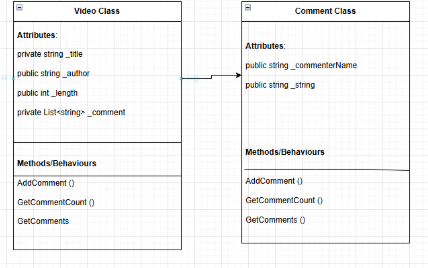

# W04 Assignment: YouTube Video Program

## Overview
The first principle of Programming with Classes is Abstraction. For this assignment, you will write a program that demonstrates your knowledge of abstraction.

## Scenario
Assume you have been hired by a company that monitors product awareness by tracking the placement of their products in YouTube videos. They want you to write a program that can help them work with the tens of thousands of videos they have identified as well as the comments on them.

Note: The YouTube example is just to give you a context for creating classes to store information. You will not actually be connecting to YouTube or downloading content in any way.

## Program Specification
Write a program to keep track of YouTube videos and comments left on them. As mentioned this could be part of a larger project to analyze them, but for this assignment, you will only need to worry about storing the information about a video and the comments.

Your program should have a class for a Video that has the responsibility to track the title, author, and length (in seconds) of the video. Each video also has responsibility to store a list of comments, and should have a method to return the number of comments. A comment should be defined by the Comment class which has the responsibility for tracking both the name of the person who made the comment and the text of the comment.

Once you have the classes in place, write a program that creates 3-4 videos, sets the appropriate values, and for each one add a list of 3-4 comments (with the commenter's name and text). Put each of these videos in a list.

Then, have your program iterate through the list of videos and for each one, display the title, author, length, number of comments (from the method) and then list out all of the comments for that video. Repeat this display for each video in the list.

## User Interaction
The focus of the Foundation programs is to help you design and build the classes and work with the relationships among these classes. With that in mind, you do not need to create a menu system or a user interface. Instead, your Program.cs file should create the required objects, set their values, and display them as specified, without any user interaction.

## Showing Creativity
Because the purpose of these Foundation programs is to help you practice the principles of the course in a very direct way, you are not expected to show creativity and exceed the core requirements the way you have in previous projects. You can earn 100% by completing the requirements as specified.

## Develop the Program
In the course repository, find the YouTubeVideos project in the week04 folder and write your program there.

## Submission Instructions
Because this project does not have any user interaction, for submission, you will include a screenshot of your program execution in your GitHub repository alongside the corresponding code. (See below for detailed instructions about capturing a screenshot.)

Once you have added your screenshot to your GitHub repository, return to Canvas to submit a link to your GitHub repo.

## Capturing a Screenshot
To capture and upload screenshot of the program execution, follow these steps:

1. Run your program in VS Code.
2. Maximize your VS Code window and ensure entire program execution is visible.
3. Capture screenshot.

On Windows:
1. Open Snipping Tool (Windows key + Shift + S).
2. Select 'Fullscreen Snip' from context menu.
3. Click on notification that appears.
4. Select the Save icon in the upper-right of window, select your Desktop folder, then click Save.

On Mac:
1. Capture screenshot with Command + Shift + 3 (screenshot will be automatically saved to your Desktop).
2. Drag and drop screenshot from your Desktop to your VS Code window, in the corresponding week04 folder.
3. Commit and push changes to GitHub.
4. View your project on GitHub and verify the screenshot has been added.
