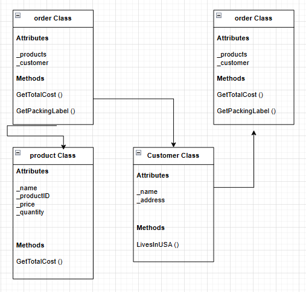

# W04 Assignment: Online Ordering Program

## Overview
The first principle of Programming with Classes is Encapsulation. For this assignment, you will write a program that demonstrates your knowledge of encapsulation.

## Scenario
Assume you have been hired to help a company with their product ordering system. They sell many products online to a variety of customers and need to produce packing labels, shipping labels, and compute final prices for billing.

## Program Specification
Write a program that has classes for Product, Customer, Address, and Order. The responsibilities of these classes are as follows:

### Order
- Contains a list of products and a customer.
- Can calculate the total cost of the order.
- Can return a string for the packing label.
- Can return a string for the shipping label.

The total price is calculated as the sum of the total cost of each product plus a one-time shipping cost.

This company is based in the USA. If the customer lives in the USA, then the shipping cost is $5. If the customer does not live in the USA, then the shipping cost is $35.

A packing label should list the name and product id of each product in the order.

A shipping label should list the name and address of the customer

### Product
- Contains the name, product id, price, and quantity of each product.
- The total cost of this product is computed by multiplying the price per unit and the quantity. (If the price per unit was $3 and they bought 5 of them, the product total cost would be $15.)

### Customer
- The customer contains a name and an address.
- The name is a string, but the Address is a class.
- The customer should have a method that can return whether they live in the USA or not. (Hint this should call a method on the address to find this.)

### Address
- The address contains a string for the street address, the city, state/province, and country.
- The address should have a method that can return whether it is in the USA or not.
- The address should have a method to return a string all of its fields together in one string (with newline characters where appropriate)

### Other considerations
Make sure that all member variables are private and getters, setters, and constructors are created as needed.

Once you have created these classes, write a program that creates at least two orders with a 2-3 products each. Call the methods to get the packing label, the shipping label, and the total price of the order, and display the results of these methods.

## User Interaction
The focus of the Foundation programs is to help you design and build the classes and work with the relationships among these classes. With that in mind, you do not need to create a menu system or a user interface. Instead, your Program.cs file should create the required objects, set their values, and display them as specified, without any user interaction.

## Showing Creativity
Because the purpose of these Foundation programs is to help you practice the principles of the course in a very direct way, you are not expected to show creativity and exceed the core requirements the way you have in previous projects. You can earn 100% by completing the requirements as specified.

## Develop the Program
In the course repository, find the OnlineOrdering project in the week04 folder and write your program there.

## Submission Instructions
Because this project does not have any user interaction, for submission, you will include a screenshot of your program execution in your GitHub repository alongside the corresponding code. (For detailed instructions about capturing a screenshot, see the Foundation #1 program description.)

Once you have added your screenshot to your GitHub repository, return to Canvas to submit a link to your GitHub repo.
