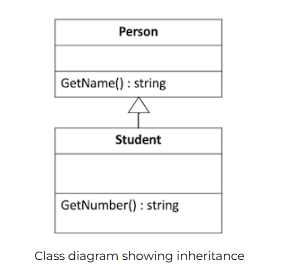
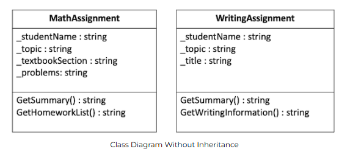
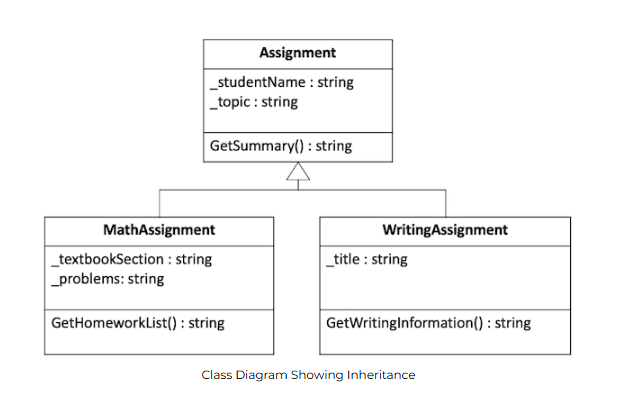

# W05 Learning Activity: Inheritance

## Overview
In this activity you will learn and practice the principle of Inheritance.

## Prepare

### What is Inheritance?
Inheritance is the ability for one class to obtain the attributes and methods of another class directly, without having to type them. It follows the same idea of people inheriting certain characteristics from their parents.

Consider two classes, a Person and a Student. A person may have a certain set attributes and methods that all people share, such as GetName(). A student is a person, so the student should have all the properties and behaviors that a person does, but then a student may have other more specific items, such as a student ID number, which could be accessed via a GetNumber() method. In this case, we could have the Student class inherit all Person class functionality, and then add to it.

Consider the following code.

```csharp
// a regular class called Person
public class Person
{
    public string GetName()
    {
        return "Joseph";
    }
}

// a class that inherits from Person
public class Student : Person
{
    public string GetNumber()
    {
        return "0123456789";
    }
}

// the student instance automatically has the GetName() method!
Student student = new Student();
string name = student.GetName();
Console.WriteLine(name);
```

Output:

```text
Joseph
```

In this case, the Person class is known as a parent class. The Student class is known as a child class. They are also called base and derived or super and sub classes. It doesn't matter what pair of terms you use as long as you understand the principle.

The syntax for specifying an inheritance relationship is different from language to language but is always found in the declaration of the child class. In C#, when defining the name of the class, you use a colon followed by the name of the parent class. No other special syntax is required.

A class diagram showing this relationship shows the base class on top and the derived class beneath it. An arrow with an open arrowhead goes from the derived class to the base class.



Class diagram showing inheritance  
Class diagram showing inheritance

The real benefit of inheritance is demonstrated in the last part of the example above. You are able to call the GetName method on an instance of Student even though it is not defined in that class. The Student class automatically got it by virtue of the inheritance relationship with Person.

## Super and Base
In some circumstances, it is helpful to be able to call methods in a parent class from a child class. In C#, you use the base keyword. Consider the following code:

```csharp
// a parent class called Person
public class Person
{
    private string _name;

    public Person(string name)
    {
        _name = name;
    }

    public string GetName()
    {
        return _name;
    }
}

// a child class called Student
public class Student : Person
{
    private string _number;

    // calling the parent constructor using "base"!
    public Student(string name, string number) : base(name)
    {
      _number = number;
    }

    public string GetNumber()
    {
        return _number;
    }
}

Student student = new Student("Brigham", "234");
string name = student.GetName();
string number = student.GetNumber();
Console.WriteLine(name);
Console.WriteLine(number);
```

Output:

```text
Brigham
234
```

In this example, the Student class inherits from the Person class. The Student constructor calls the Person constructor using the base keyword, and passes the name parameter through.

Note that base is not limited to constructors. We can use it anywhere in the derived class methods, with dot notation, to invoke a behavior in the parent class as the following example shows.

```csharp
string number = base.GetName();
Console.WriteLine($"Student Number: {number}");
```

## Accessing Private Data
In the example above, the Student inherits the member variable _name from the base class, but because it is private, you cannot access _name directly in methods defined in the Student class. Consider a method for students called, GetStudentInfo() that returns both the student's name and id number. You may want to write something like the following:

```csharp
public class Student : Person
{
    private string _number;

    ...

    public string GetStudentInfo()
    {
        // ERROR! This line doesn't work, because _name is private in the base class
        return _name + " " + _number;
    }
}
```

There are two ways to fix this problem. The first is to create a getter for the _name variable in the base class and then, in this method, you could call the getter to access the value.

The other approach is to make the variable accessible to the derived class. We have previously learned about public and private, but there is another level in between them called protected. Member variables and methods that are labeled as protected can be accessed by methods in the class as well as by methods in derived classes, but they cannot be accessed by code outside of these classes.

So which is better?

Generally speaking, we should try to limit the access to variables as much as possible, so because making a member variable protected rather than private increases access to it, it can open the door for more problems later. So it is usually better to leave the variable private and use the getter. There are cases, however, where this causes more problems than it helps and it makes sense to make the variable protected and access it directly in the derived class.

## Substitution and Is-A Relationships
An important point to note with inheritance is that because a derived class "is a" more specific version of a super class (for example, a student "is a" person), not only does the derived class inherit all of the traits and behaviors of the super class, but you should be able to use the derived class anywhere you can use the super class.

For example, because a Student is a Person, any code that works with a Person object should be able to work with a Student object without breaking. This includes passing the Student object to functions that expect a Person object, as well as putting a Student object in a list of Person objects.

This concept of substitution will become even more important with principle of Polymorphism, which is the topic of the next lesson.

### Liskov Substitution Principle
The idea of being able to substitute a derived object in place of an inherited type is formally called the Liskov Substitution Principle, named after Barbara Liskov who introduced it at a conference in 1987.

You might also note that the Liskov Substitution Principle is the "L" of the popular SOLID design principles of object oriented programming.

## Video Demonstrations
Please watch the following videos that discuss these concepts in more detail:

- Inheritance (8 minutes) (Direct link)
- Inheritance in C# (7 minutes) (Direct link)
- Inheritance Details in C# (8 minutes) (Direct link)

## A Word of Caution
Inheritance is a powerful principle that can save many hours of coding. However, overusing it may lead to problems. Consider a long inheritance chain of 10, 15, 20 or even more classes! It can be extremely difficult and time consuming to inspect a long inheritance hierarchy just to understand a single class at the bottom.

Patrick Wyatt, a long time game developer, wrote about this problem in a blog post called, Tough times on the road to Starcraft. Inheritance belongs in programs with classes. However, Mr. Wyatt's experience is very instructive.

Opinions vary, but a good rule of thumb is to limit inheritance levels to the average number of items a person can remember at once. For most people, that means three or four. If you find yourself creating more, stop and ask the question, "Do I actually need a different abstraction?"

## In Summary
Inheritance is the third principle of programming with classes. The key to understanding it is to remember that inheritance is mechanism for code reuse. Instead of writing the same thing over and over again we can simply inherit from one class to another.

Be careful though. As a certain uncle once said to his budding superhero nephew, "with great power comes great responsibility!" Discipline yourself in how you apply inheritance. Keep your hierarchies shallow and manageable. You'll be able to add more functionality in less time all while ensuring your program stays maintainable.

## Activity Instructions
Practice the principle of inheritance by creating a base class and derived classes.

For this activity, you will write classes to represent different kinds of homework assignments. Consider the following example of Math and writing assignments.





### Math Assignments
A Math assignment may need to store the student's name, the topic (for example, "Fractions"), the textbook section (for example, "7.3"), and the problems from that section (for example, "3-10, 20-21").

The Math assignment should have a constructor that requires a value for each of the items that it stores.

The Math assignment needs to provide a method to return a summary of the assignment that contains the student's name and the topic, and it also needs to provide a method to display the Math homework list including the section number and the problems (for example, "Section 7.3 Problems 8-19").

### Writing Assignments
A writing assignment may need to store the student's name, the topic (for example, "European History"), and the title of the assignment (for example, "The Causes of World War II").

The writing assignment should have a constructor that requires a value for each of the items that it stores.

The writing assignment needs to provide a method to return a summary of the assignment that contains the student's name and the topic, and it also needs to provide a method to get the writing information which consists of the title and the student's name (for example, "The Causes of World War II by Mary Waters").

## Design the Classes
There are a number of things these classes have in common and a number of differences. Using inheritance, you can separate the things that change from the things that stay the same, putting the common elements in a base class and the differing elements in a derived class.

Consider the following class diagram:

Class Diagram showing separate classes  
Class Diagram Without Inheritance

From these diagrams you can see that the _studentName and _topic attributes are the same in both classes, and so is the GetSummary() method. Instead of duplicating these items, you can create a base class that they both inherit from.

The following class diagram shows an approach that uses inheritance. This is the approach you will use for this assignment.

Class Diagram showing inheritance  
Class Diagram Showing Inheritance

## Start the Project
- Open the class project in VS Code.
- Navigate to the Homework project in the week05 folder. Find the Program.cs file, which will be your entry point for the program.
- Verify that you can run the project.

## Create the base class
1. Begin by creating a new file and a class for your base Assignment class.
2. Add the attributes as private member variables.
3. Create a constructor for this class that receives a student name and topic and sets the member variables.
4. Add the method for GetSummary() to return the student's name and the topic.
5. Test your class by returning to the Main method in the Program.cs file. Create a simple assignment, call the method to get the summary, and then display it to the screen.

Sample Output

```text
Samuel Bennett - Multiplication
```

## Create the MathAssignment class
1. Create a new file for the MathAssignment class.
2. Create this class and make sure to specify that it inherits from the base Assignment class.
3. Add the attributes as private member variables. Make sure that you do not create new member variables for the ones you inherited from the base class.
4. Create a constructor for your class that accepts all four parameters, have it call the base class constructor to set the base class attributes that way.
5. Add the GetHomeworkList() method.
6. Test your class by returning to the Main method and creating a new MathAssignment object and set its values. Make sure to test both the GetSummary() and the GetHomeworkList() methods.

Sample Output

```text
Roberto Rodriguez - Fractions
Section 7.3 Problems 8-19
```

## Create the WritingAssignment class
1. Follow the same pattern as before by creating a new file for the WritingAssignment class.
2. Create the class and set up the inheritance relationship.
3. Add the member variables and set up the constructor as you did for the MathAssignment class.
4. Add the GetWritingInformation() method.

Notice that this method needs to access the _studentName variable defined in the base class. Even though WritingAssignment class inherited this attribute, it is private, so you cannot access it directly in the derived class.

To get the data you need for the method you can either make the variable protected in the base class, or you can create a public GetStudentName method to return it.

Return to Main and test your new class.

Sample Output

```text
Mary Waters - European History
The Causes of World War II by Mary Waters
```

## Sample Solution
When you have finished please compare your approach to the following sample solution (you may also use this sample solution as a guide if you need help finishing).

Learning Activity 05 Sample Solution.

## Submission
Verify that each of your classes works as described above.
Commit and push your code to your GitHub repository.
Verify that you can see your updated code at GitHub.
Submit the Canvas quiz to report on your work.
