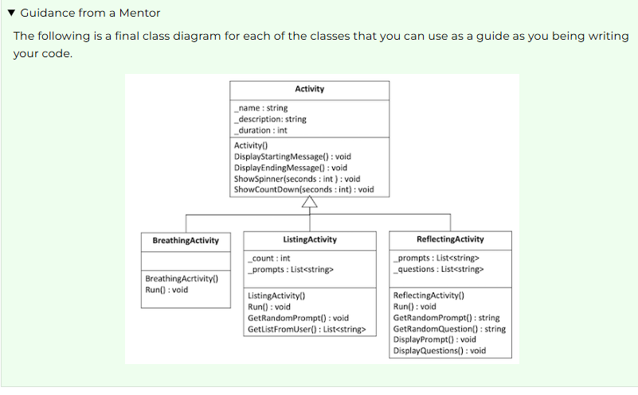

W05 Team Activity: Mindfulness Design
Overview
Meet with your team and prepare a design for this week's programming assignment.

Regarding "Guidance from a Mentor"
Remember that throughout the activity, you'll receive Guidance from a Mentor. You should first answer the questions as a team, then, refer to the Guidance from a Mentor section to make sure you are on a good path.

Make sure to expand and read each Guidance from a Mentor section as you move through the activity.

Agenda
Use the following as an agenda for your team meeting. Whoever is assigned to be the lead student for this gathering should help guide the group through these steps and ask the questions listed here.

Before the meeting: Verify the time, location, and lead student
This could be as simple as posting a message to your MS Teams channel that says something like, "Hi guys, are we still planning to meet tomorrow at 7pm Mountain Time? Let's use the MS Teams video feature again." Or, if someone else has already posted a message like this, it could be as simple as "liking" their message.

Make sure to identify who will be the lead student for this week. For example, "Emily, are you still good to be the lead student for this week?"

Begin with Prayer
Discuss the Preparation Learning Activity
Take a minute to talk about the learning activity from this week. Talk through any difficulties that people had understanding the material or completing the activity.

What part of the learning activity was the hardest for you?
Review the Program Specification
Refer to the Mindfulness program specification. As a team, review the program requirements and how it is supposed to work.

What does the program do?
What user inputs does it have?
What output does it produce?
How does the program end?
Guidance from a Mentor
Looking at the menu for the program can be a good place to start.

Take the time to go through each activity and discuss the way that activity should work. What does it require the user to type in? What does it display to the user?

Determine the classes
The first step in designing a program like this is to think about the classes you will need. When thinking about classes, it is often helpful to consider the strong nouns in the program description.

What are good candidates for classes in this program?
What are the primary responsibilities of each class?
Guidance from a Mentor
The main components of this program are the activities. Recognizing that they will all have some behaviors and attributes in common, it makes sense to have a base class and then derived classes for each specific kind of activity, such as:

Activity (The base class that contains all shared functionality)
BreathingActivity
ReflectingActivity
ListingActivity
Notice that these classes all pass the "is a" test, because a Breathing activity is an activity, etc.

You might also to have a class to handle the menu and interaction, or you might choose to handle this directly in your Main method in the Program class.

Evaluate the Design
What is a benefit of having a base Activity class, instead of having only the three specific activity classes themselves?
Define class behaviors
Now that you have decided on the classes, you will need and their responsibilities, the next step is to define the behaviors of these classes. These will become methods for the class.

Go through each of your classes and ask:

What are the behaviors this class will have in order to fulfill its responsibilities? (In other words, what things should this class do?)
Guidance from a Mentor
The biggest trick here is that if any behavior is used by all the activities then you should include it in the base class.

For example, each of the following are common behaviors that should be in the base class:

Displaying the starting message
Displaying the ending message
Pausing while showing a spinner for a certain number of seconds
Pausing while showing a countdown timer for a certain number of seconds
The following behaviors might be similar in name, but different in the way they behave, so they would need to be defined separately for each derived class: (As a side note, in the next unit you will learn an even more clever way to handle methods like this.)

Run the activity
Finally, there are behaviors for each activity that are completely unique to that activity. For example, the ListActivity also needs to provide behaviors for:

Get a random prompt
Get a list of responses from the user
The Reflecting activity needs to provide the following:

Get a random prompt to show
Get a random question about the prompt
Display the prompt
Display questions about the prompt and get answers
In addition, as you start to implement these behaviors, you might find it beneficial to have other "helper" functions that are used internally to perform part of the task of these behaviors. These become private methods of the class.

Converting these ideas to concise method names gives us the following:

Activity
DisplayStartingMessage() : void
DisplayEndingMessage() : void
ShowSpinner(seconds : int) : void
ShowCountDown(second : int) : void
BreathingActivity
Run() : void
ListingActivity
Run() : void
GetRandomPrompt() : string
GetListFromUser() : List<string>
ReflectingActivity
Run() : void
GetRandomPrompt() : string
GetRandomQuestion() : string
DisplayPrompt() : void
DisplayQuestions() : void
Evaluate the Design
Notice that all three of the derived classes contain a run function. Why can it not be defined in the base class and inherited?
Can a derived class method call a base class method? For example, can DisplayQuestions() in the ReflectingActivity class call the ShowSpinner() method? Why or Why not?
Define class attributes
Now that you have defined the classes, their responsibilities, and their behaviors, the next step is to determine what attributes the class should have, or what variables it needs to store.

Go through each of your classes and ask:

What attributes does this class need to fulfill its behaviors? (In other words, what variables should this class store?)
What are the data types of these member variables?
Guidance from a Mentor
Once again, you need to think about the attributes that are in common and include them in the base class. Then, each derived class may have its own unique attributes as well.

Base class attributes should include:

The activity name
The description
The duration in seconds
The Breathing Activity likely does not need any attributes, but the listing activity should store a count of the number of items listed, and a list of prompts to draw from. Similarly, the Reflecting Activity should store a list of questions and a list of prompts to draw from.

The following shows all the member variables:

Activity
_name : string
_description : string
_duration : int
BreathingActivity
None needed
ListingActivity
_count : int
_prompts : List<string>
ReflectingActivity
_prompts : List<string>
_questions : List<string>
Evaluate the Design
Notice that two of the three activity classes store a list of prompts. What is a potential benefit of defining it in those classes as apposed to including it in the base class and having the activity that does not need it simply ignore it and leave it empty?
Define Constructors
Now that you have defined the classes, including their methods and attributes, the next step is to think about the constructors that will be used to create new instances of these classes. Remember that you can create multiple constructors with different parameters to make it easy to work with your classes.

Remember, that constructors help set up the initial state of the object, so you should consider what data is necessary for that initial state.

What constructors should each class have?

In other words, what parameters should you pass in when creating an object of that type.
What other work needs to be done to set up these objects?

For example, does the constructor need to run code to perform set up tasks, like creating lists, iterating through variables, etc.
Guidance from a Mentor
The base class will need to initialize all of its member variables. You might require them to be passed in as parameters or you might have a constructor that sets some/all to default values to be changed later.

Then, the derived class constructor may be able to set good values in the base class even if you don't pass parameters to it. For example, a constructor that has no parameters could look like this:

    public ReflectingActivity()
    {
        _name = "Reflecting";
        _description = "This activity will help you reflect on times ...";
        _duration = 50;

        // Set other values here that are unique to the Reflecting Activity
    }
The code above shows the most simple and straightforward way to do this and assumes the variables are protected (not private) in the base class. You could also use setters or pass them to the base base class constructor directly.

In addition to initializing the variables, the constructors for the ListingActivity and the ReflectingActivity need to initialize the list of prompts (and questions for the Reflecting activity) and populate them with values.

Evaluate the Design
What is a benefit to requiring parameters for a constructor, instead of simply using the no-argument constructor and letting people use setters later to set the values?
Review the Design
Take a minute to review your final design.

Are there any classes, methods, or variables, that you do not understand?
Guidance from a Mentor
The following is a final class diagram for each of the classes that you can use as a guide as you being writing your code.

Mindfulness program class diagram
Conclude
At this point, you have the design of the classes you will need for this project. If your design is not "perfect," or it needs to change as you begin working on the project, that is just fine! As you learn more details, you will naturally need to adjust your planning. This is why the principles of programming with class are so valuable, because they allow your program to easily change.

At the end of your meeting:

Determine who will be the lead student for the next meeting.
After the Meeting: Start the code
After the team activity, each person needs to individually do the the following:

Open the project in VS Code. Create new files that contain the "stubs" or empty code for all the classes, member variables, and functions in your design.

At this point the body of the methods can be empty, except for the necessary return statements.
Each class should be in its own file and the name of the file should match the class name.
Make sure that your program can build without errors.
Commit and push your code to your GitHub repository.
Submission
After completing this activity, as before, return to Canvas to submit two quizzes associated with this activity:

W05 Team Activity: Mindfulness Design
W05 Team Activity: Participation Report