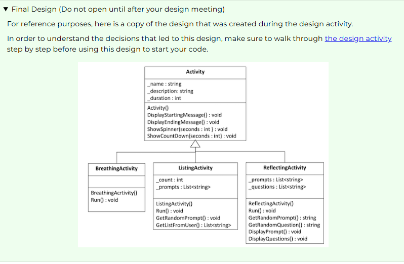

W05 Project: Mindfulness Program
Problem Overview

We live in a fast-paced world full of stress and anxiety. We could each benefit from taking time for mindfulness activities where we can reflect and unwind.

Most people would agree that we should take more time to be mindful, but relatively few of us do. Think to yourself for a moment about some reasons that you think keep people from doing this. Could a program or an app help with any of these reasons?

Some of the problems you considered may have included:

We forget
We get busy
We think it will take too long, so we don't start
We don't know where to begin. We know we should reflect on something but don't know what to start with.
While it may not resolve all of the issues that keep people from taking more time for reflection, a great program could help people by providing structure and prompts to guide them through various exercises.

Solution Idea
Consider an app that provides three different kinds of mindfulness opportunities. It could give some guidance and structure to users in the following activities:

Breathing Activity - Help the user pace their breathing to have a session of deep breathing for a certain amount of time. They might find more peace and less stress through the exercise.
Reflection Activity - Guide the user to think deeply, by having them consider a certain experience when they were successful or demonstrated strength. Then, prompt them with questions to reflect more deeply about details of this experience. They might discover more depth than they previously realized.
Listing Activity - Guide the user to think broadly, by helping them list as many things as they can in a certain area of strength or positivity. They might discover more breadth than they previously realized.
The application could additional help the user keep track of the time or frequency they spend in these activities and give them gentle prompts and reminders.

The user interface of a program like this could be anything from a Website or Mobile App to one that runs on a Smart Watch and it could be done in many different kinds of colors, shapes, and styles. Learning to write a program to solve the real-world problem is the most critical part, so this assignment will focus on that, rather than creating a flashy interface.
Specification
Write a program that provides the three activities described above. It should help them work through these activities in stages using basic forms of delay (animation or countdown).

Functional requirements
Your program must do the following:

Have a menu system to allow the user to choose an activity.
Each activity should start with a common starting message that provides the name of the activity, a description, and asks for and sets the duration of the activity in seconds. Then, it should tell the user to prepare to begin and pause for several seconds.
Each activity should end with a common ending message that tells the user they have done a good job, and pause and then tell them the activity they have completed and the length of time and pauses for several seconds before finishing.
Whenever the application pauses it should show some kind of animation to the user, such as a spinner, a countdown timer, or periods being displayed to the screen.
The interface for the program should remain generally true to the one shown in the video demo.
Provide activities for reflection, breathing, and enumeration, as described below:
Breathing Activity
The activity should begin with the standard starting message and prompt for the duration that is used by all activities.
The description of this activity should be something like: "This activity will help you relax by walking your through breathing in and out slowly. Clear your mind and focus on your breathing."
After the starting message, the user is shown a series of messages alternating between "Breathe in..." and "Breathe out..."
After each message, the program should pause for several seconds and show a countdown.
It should continue until it has reached the number of seconds the user specified for the duration.
The activity should conclude with the standard finishing message for all activities.
Reflection Activity
The activity should begin with the standard starting message and prompt for the duration that is used by all activities.
The description of this activity should be something like: "This activity will help you reflect on times in your life when you have shown strength and resilience. This will help you recognize the power you have and how you can use it in other aspects of your life."
After the starting message, select a random prompt to show the user such as:

Think of a time when you stood up for someone else.
Think of a time when you did something really difficult.
Think of a time when you helped someone in need.
Think of a time when you did something truly selfless.
After displaying the prompt, the program should ask the user to reflect on questions that relate to this experience. These questions should be pulled from a list such as the following:

Why was this experience meaningful to you?
Have you ever done anything like this before?
How did you get started?
How did you feel when it was complete?
What made this time different than other times when you were not as successful?
What is your favorite thing about this experience?
What could you learn from this experience that applies to other situations?
What did you learn about yourself through this experience?
How can you keep this experience in mind in the future?
After each question the program should pause for several seconds before continuing to the next one. While the program is paused it should display a kind of spinner.
It should continue showing random questions until it has reached the number of seconds the user specified for the duration.
The activity should conclude with the standard finishing message for all activities.
Listing Activity
The activity should begin with the standard starting message and prompt for the duration that is used by all activities.
The description of this activity should be something like: "This activity will help you reflect on the good things in your life by having you list as many things as you can in a certain area."
After the starting message, select a random prompt to show the user such as:

Who are people that you appreciate?
What are personal strengths of yours?
Who are people that you have helped this week?
When have you felt the Holy Ghost this month?
Who are some of your personal heroes?
After displaying the prompt, the program should give them a countdown of several seconds to begin thinking about the prompt. Then, it should prompt them to keep listing items.
The user lists as many items as they can until they they reach the duration specified by the user at the beginning.
The activity then displays back the number of items that were entered.
The activity should conclude with the standard finishing message for all activities.
Design Requirements
In addition your program must:

Use inheritance by having a separate class for each kind of activity with a base class to contain any shared attributes or behaviors.
Avoid duplicating code in classes where it could instead be placed in a base class.
Follow the principles of encapsulation and abstraction by having private member variables and putting related items in the same class.
Simplifications
For the core requirements you do not need to worry about the following:

Your program does not need to track any statistics such as how many times or how frequently the user has done an activity.
When getting random questions or prompts, you can just choose a random one from the list. You don't have to worry about if it was already chosen this session, or worry about running out of prompts.
Showing Creativity and Exceeding Requirements
Meeting the core requirements makes your program eligible to receive a 93%. To receive 100% on the assignment, you need to show creativity and exceed these requirements.

Here are some ideas you might consider:

Adding another kind of activity.
Keeping a log of how many times activities were performed.
Make sure no random prompts/questions are selected until they have all been used at least once in that session.
Saving and loading a log file.
Adding more meaningful animations for the breathing (such as text that grows out quickly at first and then slows as they near the end of the breath).
Anything else you can think of!
Report on what you have done to exceed requirements by adding a description of it in a comment in the Program.cs file.

Video Demo
The following video demonstrates the way this program should work:

Direct link: Mindfulness Program Demo (4 minutes)

Code Helps
You might find the following code helps useful in this project:

Pausing
In the demo video, you can see the program pausing for a certain period of time. This can be done with the Thread.Sleep() method which takes an integer as the number of milliseconds for the current "thread of execution" to sleep or pause.

The following example shows how to make the computer to wait for 1 second (1000 milliseconds):

Console.WriteLine("Going to sleep for a second...");

Thread.Sleep(1000);

Console.WriteLine("I'm back!!");
Display Animations
To display an animation, such as the spinner or the countdown timer, you need to have the computer pause for a period of time, and then replace the previous character with a new one. This can be done by writing the backspace character "\b" and which works like pushing the left arrow. Then, you can write a new character over the top of it.

Because the backspace character works like pressing the left arrow, instead of a backspace, it does not delete the character on the screen. With this in mind, it is common to write "\b \b" which moves left, writes a blank space over the previous character and then moves left again so it is ready for your new character.

The following example shows how to overwrite a character after half a second:

Console.Write("+");

Thread.Sleep(500);

Console.Write("\b \b"); // Erase the + character
Console.Write("-"); // Replace it with the - character

If this code were in a loop it would continue displaying and replacing characters.

Working with Time
The C# language has a powerful Date and Time library. You might find it useful to get the current time, add a number of seconds to it, and then check if the current time is less than the new time.

This can be accomplished with the DateTime class. An object with the current time can be obtained withe DateTime.Now . Then, it has methods such as .AddSeconds(numberOfSeconds), and it works with the less than < operator as you would expect.

The following code snippet shows an example:

DateTime startTime = DateTime.Now;
DateTime futureTime = startTime.AddSeconds(5);

Thread.Sleep(3000);

DateTime currentTime = DateTime.Now;
if (currentTime < futureTime)
{
    Console.WriteLine("We have not arrived at our future time yet...")
}
The following video shows how to use these code snippets to achieve basic display animations.

Direct Link: Display Animations (13 minutes)

Design
You will work with your team to create a design for this program. Then, you will each write the code for the program individually.

Final Design (Do not open until after your design meeting)
For reference purposes, here is a copy of the design that was created during the design activity.

In order to understand the decisions that led to this design, make sure to walk through the design activity step by step before using this design to start your code.

Mindfulness program class diagram
Develop the Program
In the course repository, find the Mindfulness project in the week05 folder and write your program there.

Submission
Develop the program using the principle of Inheritance as described above.
Make sure to describe anything you have done to exceed the requirements in comments in the Program.cs file.
Commit your source code and push it to GitHub.
Verify that you can see your updated code at GitHub.
In Canvas, submit a link to your GitHub repository. In the submission comment, describe anything you have done to show creativity and exceed the core requirements.

W05 Assignment: Explain Inheritance
Overview
Articulate the principle of inheritance.

Instructions
Now that you have learned about the principle of inheritance, and designed and developed a program using it, return to Canvas and answer the following question (the way you would in a job interview):

What is inheritance and why is it important?
Your response must:

Explain the meaning of Inheritance.
Highlight a benefit of Inheritance.
Provide an application of Inheritance.
Use a code example of Inheritance from the program you wrote. (You should copy and paste a few lines of code that demonstrate the use of the principle.)
Thoroughly explain these concepts. (This likely cannot be done in less than 100 words.)
Use your own words
Remember that your goal is to learn these topics well enough that you can explain them in your own words in a job interview or when you talk with your coworkers. With this in mind, you should write your response in your own words.

You should NOT copy and paste your response from the preparation material or from another source you find online, including using an AI generator. Using a response that is not your own is a violation of the University Honor Code, will result in a 0 on the assignment or failing the class, and will not help you learn.